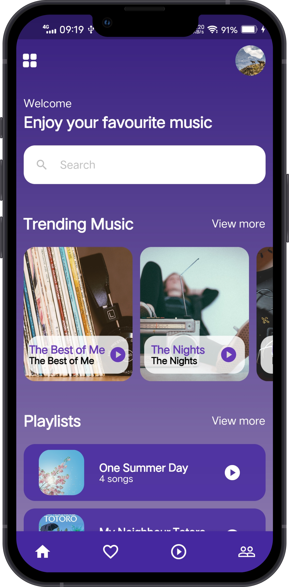

# Flutter Music Player UI

```dart
class Revaldo extends FlutterChallenge {
    return {
      "title": "Flutter Music Player App UI",
      "description": "How to build an app music player UI with flutter",
      "Design": "https://dribbble.com/shots/15522129-Music-Player-App"
    }
}
```

## Getting Started 🚀

```shell
- Clone the repo
- flutter pub get
- flutter run
```

## ScreenShot
&nbsp;&nbsp;
